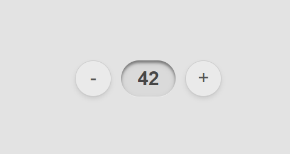

## What we are building?

Today, boys and girls, we will make animated spinner controls, which was originally designed by [@drawsgood](https://x.com/drawsgood) and posted here:
https://x.com/drawsgood/status/1797823695358165170

This is how it's going to look:

## Implementation

We will set transform origin to the right edge of the center container and rotate the image with Web Animation API.
